# SPACE Query

SPACE Query is a desktop SQL client built with Rust and FLTK. It supports Oracle, MySQL, and MariaDB connections, and bundles a SQL editor, script execution, an object browser, a result grid, query history, a session activity view, and log/crash diagnostics into a single app.

## Quick Start


| Area | What it is for |
| --- | --- |
| Left panel | Browse and filter database objects such as tables, views, and routines |
| Top toolbar | Execute or cancel SQL, explain a statement, and commit or roll back |
| Upper-right panel | Write SQL and manage multiple query tabs |
| Lower-right panel | Review data, script output, DBMS output, and execution messages |
| Bottom status bar | Check the current connection and execution status |

### 1. Connect to a database

Open **File > Connect** (`Ctrl+N`), select the database type, and enter the
connection details. You can test the settings, save them for later, or connect
immediately. Saved passwords are kept in the OS Keyring, not in the config
file.

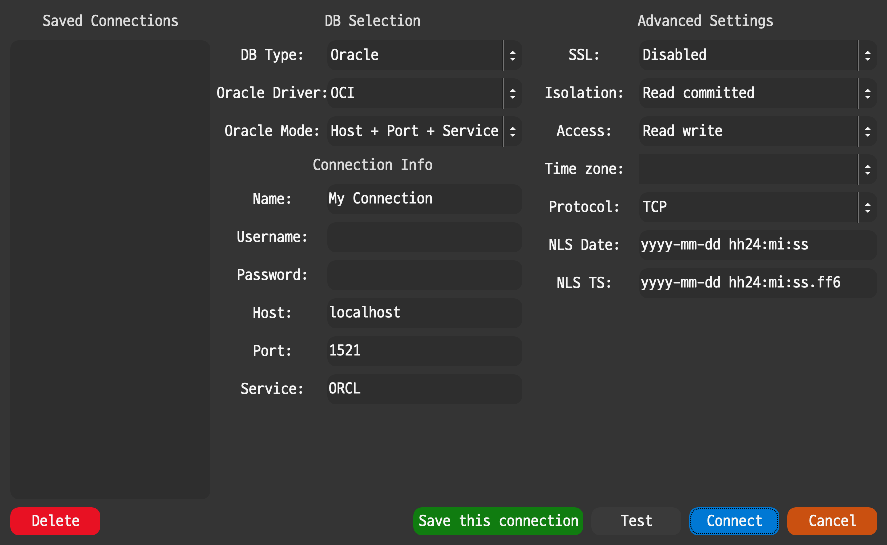

- **Oracle:** choose OCI or Thin. Thin works without Oracle Instant Client and
  uses Host, Port, and Service.
- **MySQL / MariaDB:** enter Host, Port, Username, Password, and the optional
  database name, then adjust SSL or session options if needed.

### 2. Write and run SQL

Enter SQL in the active query tab, then use the toolbar or a shortcut:

On macOS, use `Cmd` where `Ctrl` is shown.

- `Ctrl+Enter` or `F9`: run the statement at the cursor
- Select text and press `Ctrl+Enter`: run only the selection
- `F5`: run the entire script
- `F6`: show Explain Plan / EXPLAIN
- `F7` / `F8`: commit / roll back

### 3. Review the result

- **Data Grid:** query rows, selection/copy, CSV export, and lazy fetch controls
- **Script Output / DBMS Output:** script transcripts and server output
- **Messages:** execution information, affected-row counts, and errors
- **Tools > Session Activity:** active connection, pool, query, and result-tab state

Use **File > Disconnect** (`Ctrl+D`) when you are finished. If a query, lazy
fetch, or pending edit is still active, SPACE Query asks how to resolve it
before changing the connection.

## Feature Tour

### IntelliSense and object-aware editing

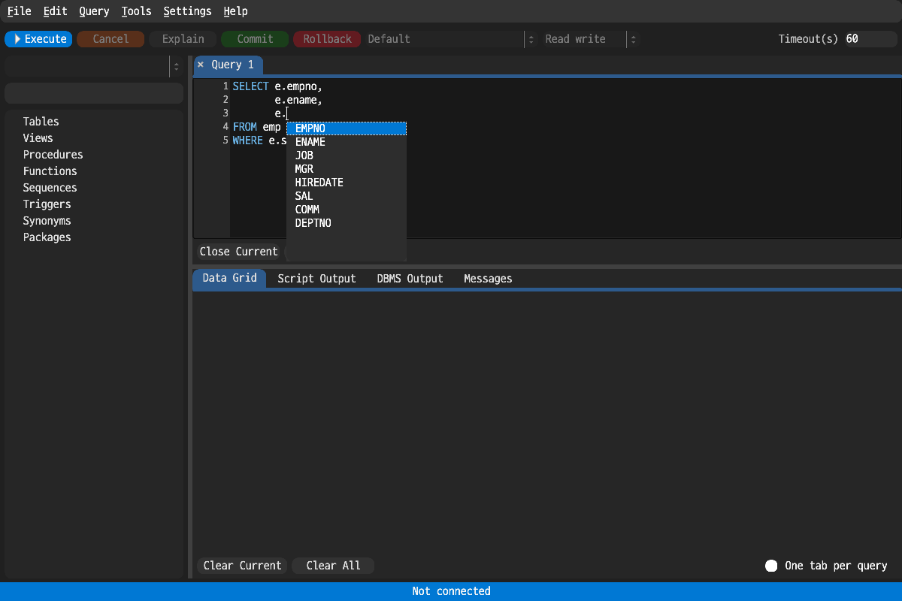

Press `Ctrl+Space` (`Cmd+Space` on macOS) to open suggestions at the cursor.
The list adapts to the SQL context and can include keywords, tables, views,
aliases, columns, routines, packages, and other objects loaded from database
metadata. Use the arrow keys to move, `Enter` or `Tab` to insert, and `Esc` to
close the list.

The editor also provides syntax highlighting, quick describe (`F4`), find and
replace, comment toggling, case conversion, SQL block selection, and multiple
query tabs.

### Automatic SQL formatting

Before formatting:

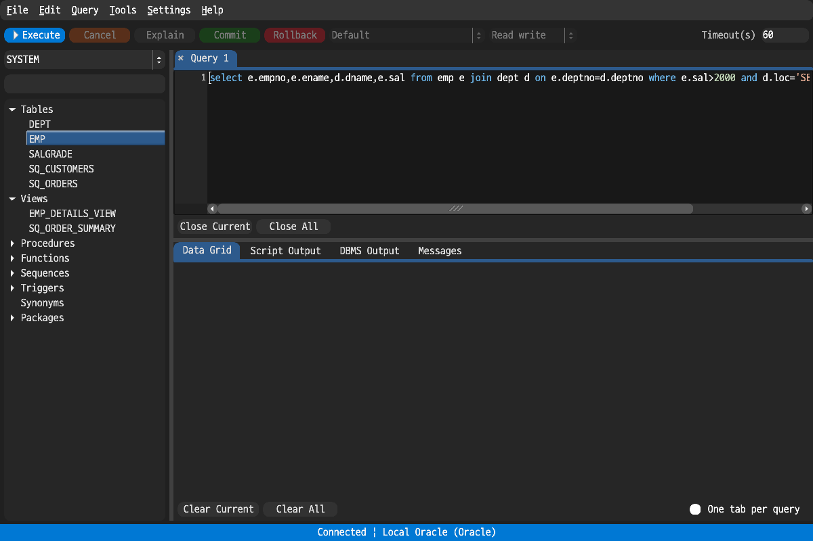

After `Ctrl+Shift+F`:

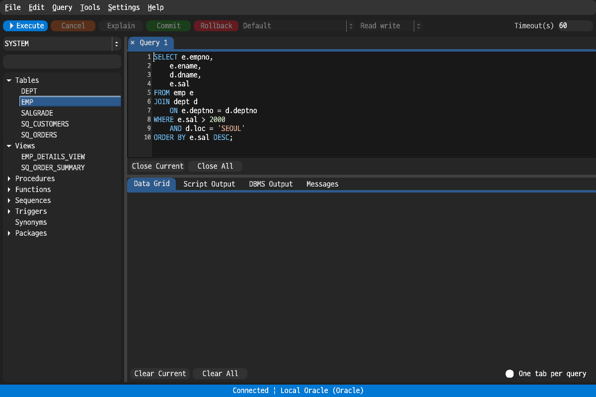

Select SQL or place the cursor inside a statement and press `Ctrl+Shift+F`
(`Cmd+Shift+F` on macOS). The formatter applies SQL-aware line breaks and
indentation while keeping the statement editable in place. It supports the
Oracle and MySQL/MariaDB dialect paths used by the active connection.

### Result grid selection, copy, and export

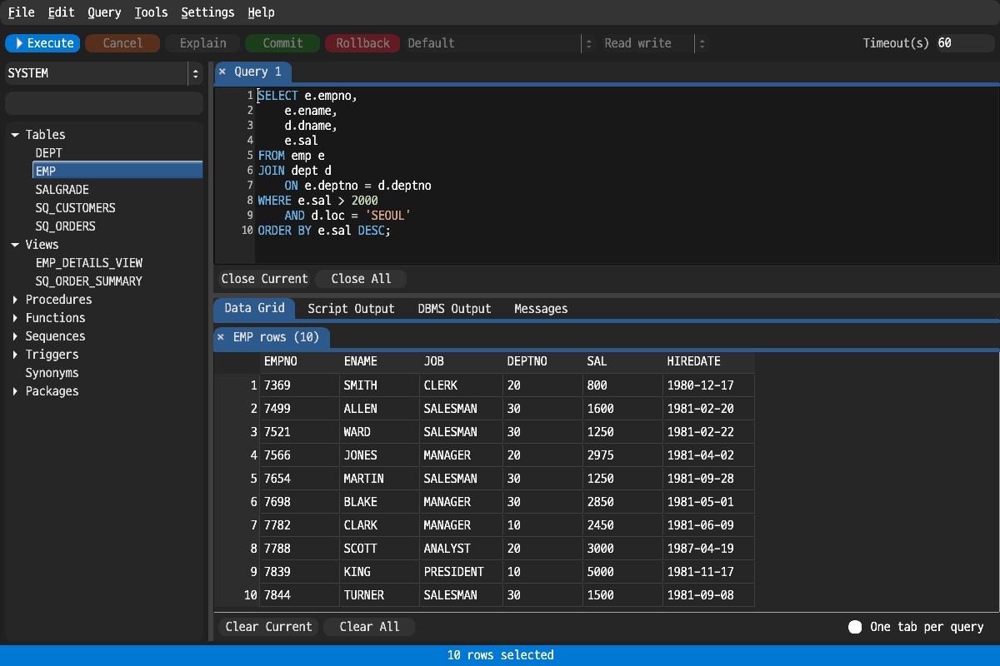

- Drag or use the keyboard to select a cell range.
- `Ctrl+C` copies selected cells; `Ctrl+Shift+C` includes column headers.
- `Ctrl+A` selects the grid and `Ctrl+E` exports the result as CSV.
- Column widths can be resized and column headers can be used for grid sorting.
- Large result sets use lazy fetch. Scrolling near the end requests more rows;
  actions that need the complete result can request the remaining rows first.
- Right-click the grid for close, copy, copy-all, CSV, and edit-related actions.

The result area separates **Data Grid**, **Script Output**, **DBMS Output**, and
**Messages**, so tabular rows, script transcripts, server output, and errors do
not overwrite one another.

### Staged Oracle result editing

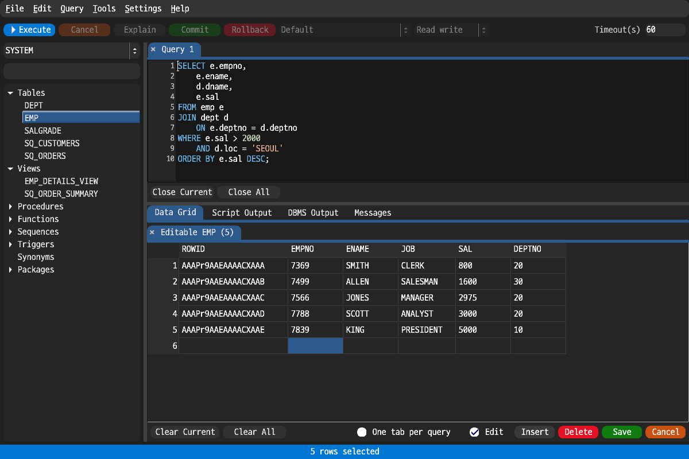

For a safely identifiable Oracle single-table result containing a usable
`ROWID`, enable **Edit** to stage cell changes. You can insert or delete rows,
set selected cells to `NULL`, save all staged changes, or cancel them. The
database is not changed until **Save** is selected.

JOIN results, multi-table queries, and results without a reliable `ROWID` stay
read-only to avoid updating the wrong rows.

### Object browser and workspace layout

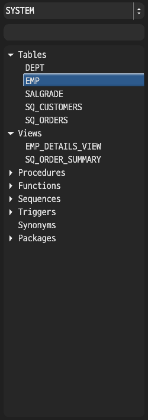

The left panel groups objects by database type and supports filtering, refresh,
data queries, structure/index/constraint views, DDL generation, and package
routine browsing. The center workspace keeps SQL files in separate tabs, while
the lower panel keeps each result and message stream available independently.

### Appearance, result, and connection settings

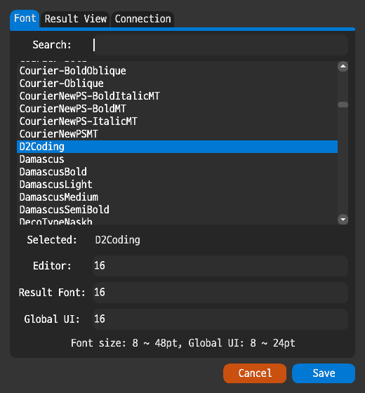

Open **Settings > Preferences** to select the editor/result font and sizes,
change the global UI size, configure result preview and lazy-fetch limits, and
set connection-pool and cancellation options. Settings are persisted for the
next application run.

### Query history

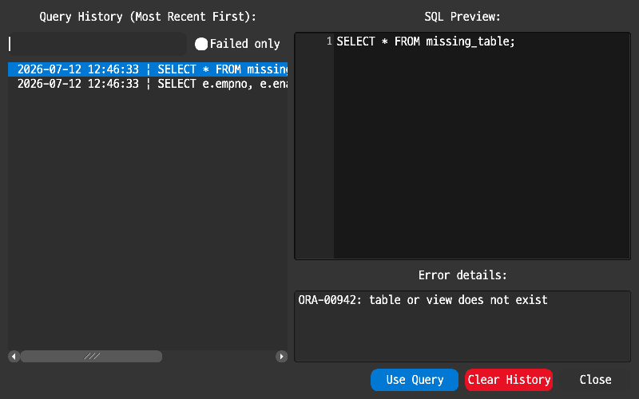

Open **Tools > Query History** to search previously executed SQL, filter failed
statements, inspect the SQL and error details, and place a selected statement
back into the editor with **Use Query**. History belongs to the current running
app process.

### Session activity

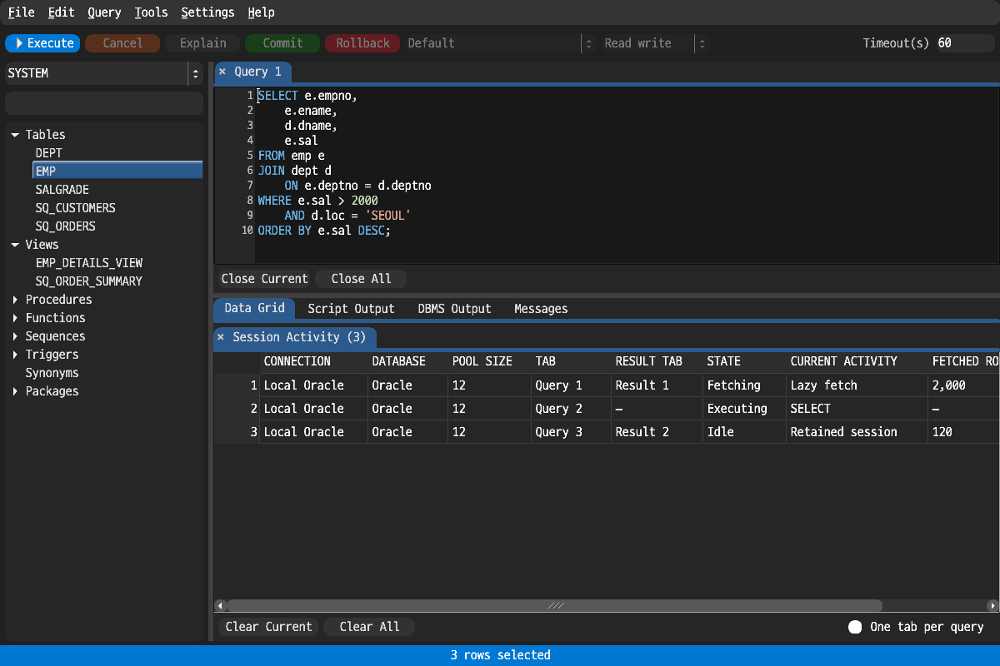

Open **Tools > Session Activity** to see how the active connection pool is being
used across query and result tabs. The view reports running SQL, lazy fetches,
retained sessions, fetched-row counts, and elapsed time, which is useful when a
connection switch or pool resize is waiting for active work to finish.

### Application logs and recovery

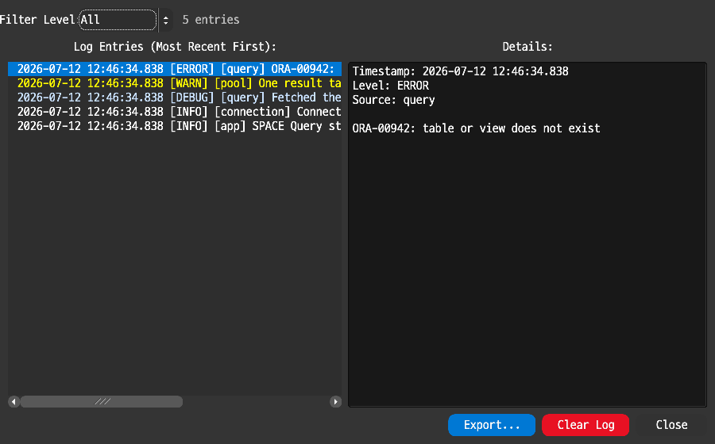

Open **Tools > Application Log** to filter entries by level, inspect a selected
entry, export the visible log, or clear it. SPACE Query also records panic
details in `crash.log` and shows the previous crash report on the next launch.

### Regenerating the screenshots

The capture source is kept in `src/bin/capture_feature_tour.rs`. On macOS, run:

```bash
./scripts/capture_feature_tour.sh
```

To regenerate only the object-browser image:

```bash
./scripts/capture_feature_tour.sh object-browser
```

The helper builds the capture binary using the normal Cargo environment, runs
it with isolated application settings, and updates the PNG files under
`docs/images`.

## Supported Databases

- Oracle
  - Supports a choice between Thin mode (built-in TNS client) and OCI (thick) mode
  - Thin mode connects without Oracle Instant Client; OCI mode requires the Instant Client or Full Client
  - Both modes support Host/Port/Service connections; TNS alias connections are available only in OCI mode
  - Thin mode supports TCP; OCI mode supports TCP/TCPS
  - Supports NLS date/timestamp format, session time zone, and default transaction option settings
- MySQL
  - Supports database selection, SSL options, SQL mode, charset/collation, and session time zone settings
- MariaDB
  - Shares the MySQL-family execution backend and SQL dialect, but is managed separately as a distinct database type
  - Separates the MariaDB time zone range and some message handling

## Key Features

### Connections and Sessions

- Managed list of saved connections
- Passwords are stored in the OS Keyring rather than in the config file
- Per-connection advanced option validation
- Maintains a recent SQL file list
- Connection-pool-based session acquisition
- Lazy fetch for long queries and per-result-tab session tracking
- Checks for running queries and lazy fetch state before switching connections, disconnecting, or commit/rollback
- View the current connection/pool/result-tab state under Tools > Session Activity

### SQL Editor

- Multiple SQL tabs
- New SQL file, open, save, save as, close
- Syntax highlighting
- IntelliSense popup
- Find / Replace
- SQL formatting
- Comment toggle
- Uppercase/lowercase conversion of the selection
- Select and execute the current statement
- Execute the selection
- Execute the entire script
- Execution timeout input
- Previous/next navigation through query history
- Quick Describe at the cursor position

### Execution

- `F5`: Run script
- `Ctrl+Enter`, `F9`: Run current statement
- `F4`: Quick Describe
- `F6`: Explain Plan / EXPLAIN
- `F7`: Commit
- `F8`: Rollback
- Tools > Auto-Commit toggle
- Oracle bind variable, `PRINT`, and ref cursor result handling
- MySQL/MariaDB `SHOW`, `DESC`, `EXPLAIN` result set handling
- Displays execution results and messages in separate result tabs

### Script and Tool Commands

Script execution uses a dedicated parser together with session state, not simple semicolon splitting.

Oracle / SQL*Plus family:

- `VAR`, `VARIABLE`, `PRINT`
- `SET SERVEROUTPUT`
- `SET DEFINE`, `SET SCAN`, `SET VERIFY`, `SET ECHO`, `SET TIMING`, `SET FEEDBACK`, `SET HEADING`
- `SET PAGESIZE`, `SET LINESIZE`, `SET TRIMSPOOL`, `SET TRIMOUT`, `SET SQLBLANKLINES`, `SET TAB`, `SET COLSEP`, `SET NULL`
- `SHOW ERRORS`, `SHOW USER`, `SHOW ALL`
- `DESC`, `DESCRIBE`
- `PROMPT`, `PAUSE`, `ACCEPT`
- `DEFINE`, `UNDEFINE`, `COLUMN ... NEW_VALUE`
- `BREAK ON <column>`, `BREAK OFF`
- `COMPUTE SUM`, `COMPUTE COUNT`, `COMPUTE OFF`, with optional `OF <column> ON <group_column>`
- `CLEAR BREAKS`, `CLEAR COMPUTES`
- `SPOOL`
- `WHENEVER SQLERROR`, `WHENEVER OSERROR`
- `@`, `@@`, `START`
- `CONNECT`, `DISCONNECT`, `EXIT`, `QUIT`

MySQL / MariaDB family:

- `USE`
- `SHOW DATABASES`, `SHOW TABLES`, `SHOW COLUMNS`
- `SHOW CREATE TABLE`
- `SHOW PROCESSLIST`, `SHOW VARIABLES`, `SHOW STATUS`
- `SHOW WARNINGS`, `SHOW ERRORS`
- `DELIMITER`
- `SOURCE`

### Object Browser

- Displays different root categories depending on the database type
- Filterable tree UI
- Object refresh
- Table/view data query
- Structure view
- Index view
- Constraint view
- DDL generation
- Package routine display

Oracle root categories:

- Tables
- Views
- Procedures
- Functions
- Sequences
- Triggers
- Synonyms
- Packages

MySQL / MariaDB root categories:

- Tables
- Views
- Procedures
- Functions
- Triggers
- Events
- Sequences are shown only when actually detected

### Result View

- Separate data and message tabs
- Per-result-tab status display
- CSV export
- Copy selected cells
- Copy with headers
- Configurable maximum cell preview length
- Configurable lazy fetch batch size
- Lazy fetch additional fetch, fetch all, and cancel
- `ROWID`-based staged edits for Oracle single-table result sets
  - Insert
  - Delete
  - Save
  - Cancel
  - Set Null

Result grid editing is not available for every SELECT. The current implementation assumes a safely identifiable Oracle single-table result set, and does not treat JOIN results or results to which a `ROWID` cannot be reliably attached as editable.

### Settings, Logs, and Recovery

- UI/editor/result font settings
- Result cell preview length setting
- Lazy fetch batch size setting
- Connection pool size setting
- App settings persistence
- App log viewer
- Log export and clear
- Panic-hook-based `crash.log` recording
- Displays the previous crash report on the next run
- Migration of the legacy `oracle_query_tool` config/keyring namespace

## Requirements

- Rust toolchain (stable) — required when building from source.
- Source builds support macOS, Linux, and Windows.
- Prebuilt GitHub Release archives are currently produced for macOS arm64 and Windows x86_64.

## Running

This workspace contains multiple binaries, so you must specify `--bin space_query` when running.

Development run:

```bash
cargo run --bin space_query
```

Release run:

```bash
cargo run --release --bin space_query
```

## Building

Distribution binaries are produced with a release build.

```bash
cargo build --release --bin space_query
```

The output is created at `target/release/space_query` (`space_query.exe` on Windows).

GitHub Release archives contain the executable, `DISCLAIMER.md`, the release
owner checklist in `RELEASE_COMPLIANCE.md`, and a `licenses/` directory with
the SPACE Query licenses, third-party notices and dependency license texts,
the `tns-thin` provenance record, referenced upstream notices, and the
copyright information for the exact Rust toolchain used to build the
executable.

## Testing

Default non-live test suite for the main package:

```bash
cargo test
```

The built-in `tns-thin` package has a separate test suite because it is a path
dependency rather than a workspace member:

```bash
cargo test --manifest-path crates/tns-thin/Cargo.toml
```

Build check:

```bash
cargo check
```

Live database tests are ignored by the default commands. When running real
Oracle/MySQL/MariaDB connection tests, you must first set up a local DB,
account, and client library configuration. The Oracle Thin live and comparison
tests can be run with:

```bash
./test_tns_thin.sh
```

Pull requests and pushes to `main` run formatting, Clippy, non-live tests, and
Linux/macOS/Windows build checks in GitHub Actions. The Rust version used by
local builds and CI is pinned in `rust-toolchain.toml`.

## Release Verification

Tag releases are created only after the CI quality gates pass. Every GitHub
Release includes a `SHA256SUMS` file for the macOS and Windows archives:

```bash
sha256sum --check SHA256SUMS
```

On macOS, the equivalent command is:

```bash
shasum -a 256 --check SHA256SUMS
```

Release archives also have GitHub artifact provenance attestations. After
installing and authenticating the GitHub CLI, verify an archive with:

```bash
gh attestation verify space_query-macos-arm64.zip \
  --repo letspurify-ux/space_query
```

The checksum and provenance establish archive integrity and build origin. They
do not replace operating-system code signing; the current ZIP distributions
remain unsigned until Apple Developer ID and Windows Authenticode credentials
are configured for the release workflow.

## Oracle Client (OCI mode)

Thin mode connects without any additional client. An Oracle Instant Client or Full Client is required only in OCI (thick) mode, where the client library is auto-discovered in the following order.

1. The directory pointed to by the `ORACLE_CLIENT_LIB_DIR` environment variable
2. The `ORACLE_HOME` environment variable (Windows: `%ORACLE_HOME%\bin`, Linux/macOS: `$ORACLE_HOME/lib`)
3. The `instantclient_*` directory in platform-specific default locations
   - macOS: `/opt/oracle`
   - Linux: `/opt/oracle`, `/usr/local/oracle`
   - Windows: `C:\oracle`, `%ProgramFiles%\Oracle`

If auto-discovery does not work, set `ORACLE_CLIENT_LIB_DIR` directly.

```bash
export ORACLE_CLIENT_LIB_DIR=/opt/oracle/instantclient_23_3
cargo run --release --bin space_query
```

On Apple Silicon, the app and the client library must have the same CPU architecture.

### TNS alias connections

TNS alias connections are supported only in OCI mode, and alias resolution is performed by Oracle Net reading `tnsnames.ora`. Set the `TNS_ADMIN` environment variable to the directory containing `tnsnames.ora`. If it is not set, `$ORACLE_HOME/network/admin` is used; the Instant Client does not have this default path, so `TNS_ADMIN` is effectively required.

```bash
export TNS_ADMIN=/opt/oracle/network/admin
```

Thin mode supports only Host/Port/Service connections and does not support TNS aliases.

## Linux Build Notes

Running the GUI requires FLTK/X11 runtime dependencies. Before building, install the relevant development packages (`libxinerama`, `libxcursor`, `libxfixes`, `libxft`, etc.).

## Storage Locations

The OS-specific root of each path follows that OS's standard directory conventions, and the app directory name is `space_query`.

- Config file: `config_dir()/space_query/config.json`
- App log: `data_dir()/space_query/app.log.json`
- Crash log: `data_dir()/space_query/crash.log`
- Passwords: the `space_query` service in the OS Keyring

Notes:

- Connection information and the recent SQL file list are stored in the config file.
- Passwords are not stored in the config JSON.
- Query history is managed in the memory of the currently running app process.

## License and Trademarks

Original SPACE Query code is distributed under `MIT OR Apache-2.0`. See
`LICENSE-MIT` and `LICENSE-APACHE` for the full licenses. The bundled
`tns-thin` crate is Apache-2.0 licensed; its MIT license file applies only to
the identified `go-ora` material.

The software is provided without warranty and is subject to the limitations
described in `DISCLAIMER.md`.

The TNS thin implementation references the permissive-licensed implementations
of `python-oracledb` and `go-ora`. The relevant notices are maintained in
`THIRD_PARTY_NOTICES.md` and `crates/tns-thin/THIRD_PARTY_NOTICES.md`; exact
upstream revisions are recorded in `crates/tns-thin/PROVENANCE.md`. Maintainers
must complete `RELEASE_COMPLIANCE.md` before publishing a release.

Oracle, Java, MySQL, and NetSuite are registered trademarks of Oracle and/or its affiliates. Other names may be trademarks of their respective owners. This project is not affiliated with, endorsed by, or sponsored by Oracle.
