# SPACE Query

SPACE Query is a desktop SQL client for Oracle, MySQL, and MariaDB, built with
Rust and FLTK. It provides connection management, SQL editing with database
metadata, script execution, result inspection, and session diagnostics in one
application.

Oracle Thin mode implements the network protocol directly, so no Oracle client
library is needed to connect and run statements.


## Why SPACE Query

- **One app, three databases.** Oracle, MySQL, and MariaDB share the same
  editor, object browser, result grid, and diagnostics. The SQL dialect,
  metadata queries, and transaction rules follow the active connection.
- **No Oracle client to install.** Thin mode connects over TCP with Host, Port,
  and Service. OCI mode is available for TCPS and TNS aliases.
- **Results you can work with.** Sort, page, and lazily fetch rows, edit a
  single-table result back to the server under a safe row identifier, and copy
  any selection as CSV or as SQL that runs unchanged.
- **Visible session state.** Session activity, query history, and an
  application log report what each connection is doing. Disconnecting,
  committing, and switching connections stop for unresolved work.
- **A native desktop binary.** No runtime, no browser, no background service.

## At a glance

| Area | What you get |
| --- | --- |
| Editor | Code completion over live metadata, signature hints, code snippets, SQL-aware formatter, multiple file tabs, find and replace, quick describe |
| Execution | One statement, a selection, or a full script with SQL*Plus-style commands, bind variables, ref cursors, and per-statement timeouts |
| Results | Independent result tabs, lazy fetch, sorting, in-grid text search, selection totals, export to CSV/TSV/JSON/XML/HTML/Markdown/SQL, and staged in-grid editing |
| Objects | Filterable object tree, structure/index/constraint inspection, DDL generation, confirmed drop/truncate, file import into a table, and table browsing with database-side paging |
| Operations | Session activity, persisted query history, application log, and crash reports |

## Database support

| Database | Connection and session support |
| --- | --- |
| Oracle | Built-in Thin mode over TCP, or OCI mode over TCP/TCPS. Both accept Host/Port/Service; OCI also supports TNS aliases. Advanced options include NLS date/timestamp formats, session time zone, and default transaction behavior. |
| MySQL | Optional database selection, SSL settings, SQL mode, charset/collation, session time zone, and transaction options. |
| MariaDB | A distinct database type using the MySQL-family SQL dialect and execution backend, with MariaDB-specific time-zone validation and message handling. |

Oracle Thin mode does not require Oracle Instant Client. See
[Oracle connection modes](#oracle-connection-modes) when using OCI or a TNS
alias.

## Install and run

### Prebuilt releases

[GitHub Releases](https://github.com/letspurify-ux/space_query/releases)
currently provide archives for macOS arm64 and Windows x86_64. Extract the
archive and run `space_query` (`space_query.exe` on Windows).

The current archives are not code-signed. Use the supplied checksums and
provenance attestation to verify them as described in
[Release verification](#release-verification).

### Build from source

Source builds support macOS, Linux, and Windows. The Rust version is pinned in
`rust-toolchain.toml` and is installed automatically by `rustup`.

On Debian or Ubuntu, install the FLTK/X11 development packages first:

```bash
sudo apt-get install libx11-dev libxext-dev libxft-dev libxinerama-dev \
  libxcursor-dev libxrender-dev libxfixes-dev
```

This repository contains multiple binaries, so specify the application binary:

```bash
# Development build
cargo run --bin space_query

# Optimized build and run
cargo run --release --bin space_query
```

To create only the distribution executable:

```bash
cargo build --release --bin space_query
```

The output is `target/release/space_query` on macOS/Linux and
`target/release/space_query.exe` on Windows.

## Getting started

### 1. Connect

Open **File > Connect** (`Ctrl+N`), select a database type, enter the connection
details, and then test, save, or open the connection. Saved passwords go to the
OS keyring rather than the configuration file.

- For Oracle, choose Thin or OCI. Thin uses Host, Port, and Service without an
  external client.
- For MySQL or MariaDB, enter Host, Port, Username, Password, and an optional
  database, then adjust SSL or session options if necessary.


### 2. Edit and execute SQL

Write SQL in the active query tab, then use the toolbar or a shortcut. On
macOS, use `Cmd` where `Ctrl` is shown.

| Action | Shortcut |
| --- | --- |
| Execute the selection or statement at the cursor | `Ctrl+Enter` or `F9` |
| Execute the complete script | `F5` |
| Quick describe the object at the cursor | `F4` |
| Open the definition of the object at the cursor | `Ctrl+B` |
| Search objects by name | `Ctrl+Shift+N` |
| Explain Plan / EXPLAIN | `F6` |
| Commit / roll back | `F7` / `F8` |
| Open code completion | `Ctrl+Space` |
| Expand the code snippet at the cursor | `Tab` or `Ctrl+J` |
| Format the selection or current statement | `Ctrl+Shift+F` |
| Go to a line number | `Ctrl+G` |

The complete shortcut list is available under **Help > Keyboard Shortcuts**.

### 3. Inspect results

The lower workspace keeps each output type separate:

- **Data Grid** shows query rows and Explain Plan / EXPLAIN results, with
  selection, copy, data and SQL export, sorting, and lazy-fetch controls.
- **Script Output** and **DBMS Output** retain script transcripts and server
  output.
- **Messages** reports execution details, affected-row counts, and errors.

Use **File > Disconnect** (`Ctrl+D`) when finished. Before disconnecting,
switching connections, committing, or rolling back, SPACE Query asks you to
resolve any running query, lazy fetch, transaction, or pending grid edit that
cannot be closed safely.

## Features

### Connection colors and read-only mode

Every saved connection carries two client-side settings. They sit next to the
name and host rather than under Advanced Settings, because neither is a session
option and neither is sent to the server.

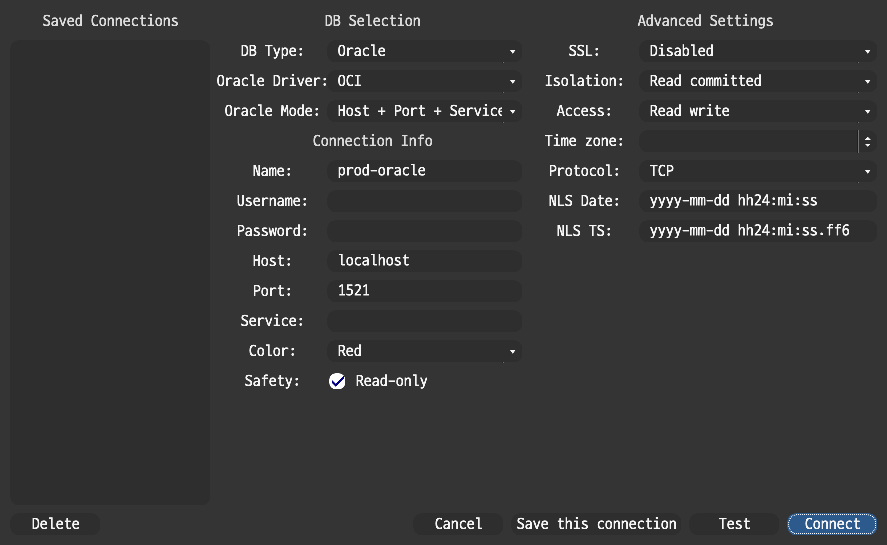

**Color** tags the connection so the window shows which database a statement
will run against. The tag is carried by the tabs: a query tab bound to a tagged
connection shows the color in its label, and the selected tab shows it as its
background. The result tabs under the editor follow the same rule.

A result keeps the color of the connection that produced it. If a query tab
loses its connection and is later bound to another database, the results the
first connection returned keep its color rather than being repainted.

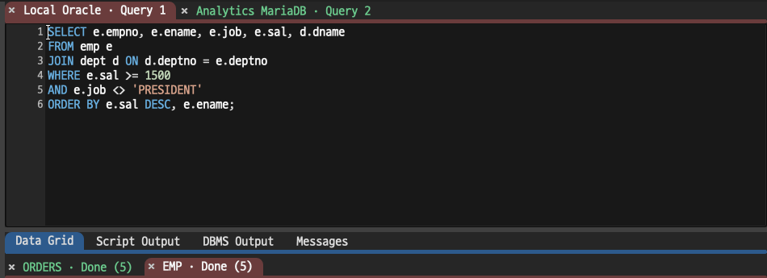

Connections with no color keep the default appearance. The status bar's
connection dot never carries a tag: it is green with a live session and red
without one, so it always reports whether a session exists.

The choices are red, orange, yellow, green, purple, and gray. Blue is not
offered, because the window already uses blue to mean "selected".

**Read-only** refuses to send anything that writes. Each statement is classified
on its own — a script of three `SELECT`s runs, a `DELETE` among them does not —
and anything that is not provably a read is refused, including a statement the
classifier cannot place. `SELECT`, `WITH`, `DESCRIBE`, `SHOW`, session settings
such as `USE` and `ALTER SESSION SET CURRENT_SCHEMA`, and `COMMIT`/`ROLLBACK`
still run. `INSERT`, `UPDATE`, `DELETE`, `MERGE`, DDL, PL/SQL blocks, and
procedure calls do not. A `@file` include is refused because its contents cannot
be checked first, and a SQL\*Plus `CONNECT` because it would leave the read-only
connection behind.

Two statements that read but also write are refused: `SELECT ... FOR UPDATE`
takes row locks that outlive it, and Oracle's `EXPLAIN PLAN FOR` inserts rows
into `PLAN_TABLE`, so `F6` Explain Plan is unavailable on a read-only Oracle
connection. MySQL and MariaDB's `EXPLAIN` only reports and stays available.

Controls that would start a write are removed rather than left to fail: the
grid's **Edit** checkbox does not appear, and the object browser drops
**Drop**, **Truncate**, **Import Data**, and **Execute Procedure/Function** from
its menus. Catalog reads — **Generate DDL**, **View Structure**,
**Check Compilation** — are unaffected. The status bar reads
`name (Oracle) · read-only`.

This is a guard inside SPACE Query, not a server-side lock. For a
server-enforced restriction, use the connection's **Access: Read only**
transaction mode or a database account without write privileges.

### SQL editor and code completion

Code completion uses the current SQL context and loaded database metadata to
suggest keywords, schemas, tables, views, aliases, columns, routines, packages,
and other objects. Use the arrow keys to select an item, `Enter` or `Tab` to
insert it, and `Esc` to close the popup. **Edit > Code Completion** opens it
from the menu, and **Settings > Preferences > Code Completion** holds its
context and popup-delay limits.

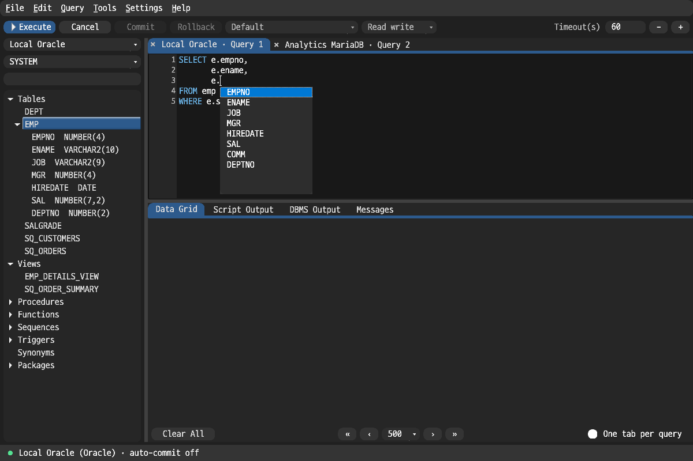

When the cursor is inside a function or procedure call, the signature hint
shows the available parameters and emphasizes the active argument. It follows
typing and mouse cursor movement, and closes when the application window moves
or resizes so it cannot remain detached from the editor.

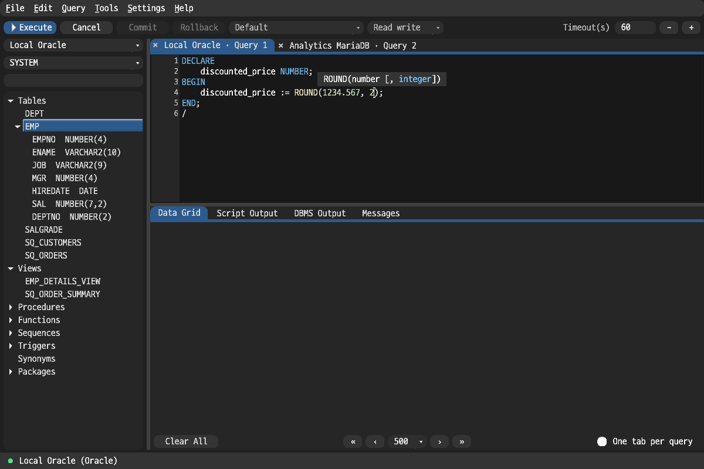

The editor also supports multiple SQL file tabs, open/save/recent files,
syntax highlighting, find and replace, undo/redo, comment toggling, selection
case conversion, SQL block selection, execution timeouts, and previous/next
query-history navigation.

#### Code snippets

Type an abbreviation and press `Tab` to expand it into a statement skeleton.
The first placeholder is selected, so typing replaces it; `Tab` again moves to
the next one, and `Esc` leaves the template. Placeholders are located by the
literal text around them, so a name typed over the first placeholder does not
shift the ones after it.


`Ctrl+J` (`Cmd+J` on macOS) also expands the abbreviation, and works while the
completion popup is open; with the popup open, `Tab` still inserts the selected
suggestion. Pressing `Ctrl+J` where there is no abbreviation before the cursor
opens the list of available snippets, which is also under
**Help > Code Snippets**.

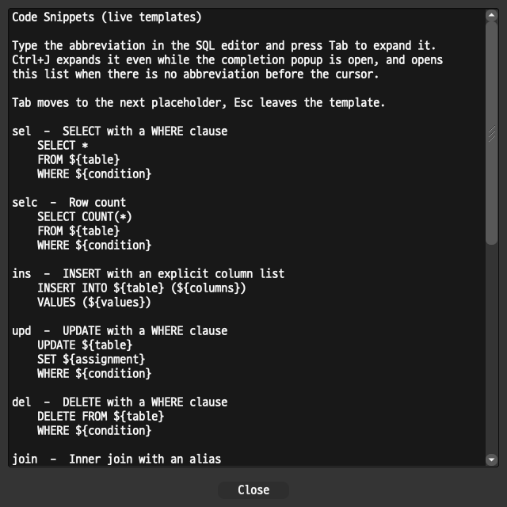

The built-in templates cover `SELECT`, `SELECT COUNT(*)`, `INSERT`, `UPDATE`,
`DELETE`, inner and left joins, `CASE`, `CREATE TABLE`, and the PL/SQL block,
`IF`, and numeric `FOR` loop. A multi-line body is indented to match the line
the abbreviation was typed on.

#### Soft wrap and Go to Line

**Edit > Soft Wrap** wraps long lines at the editor's right edge instead of
scrolling sideways, which suits generated DDL and long `IN (...)` lists. The
setting is saved and applies to every tab: the ones already open, the ones
opened afterwards, and the ones restored on the next start. The line-number
gutter numbers buffer lines, not wrapped rows.

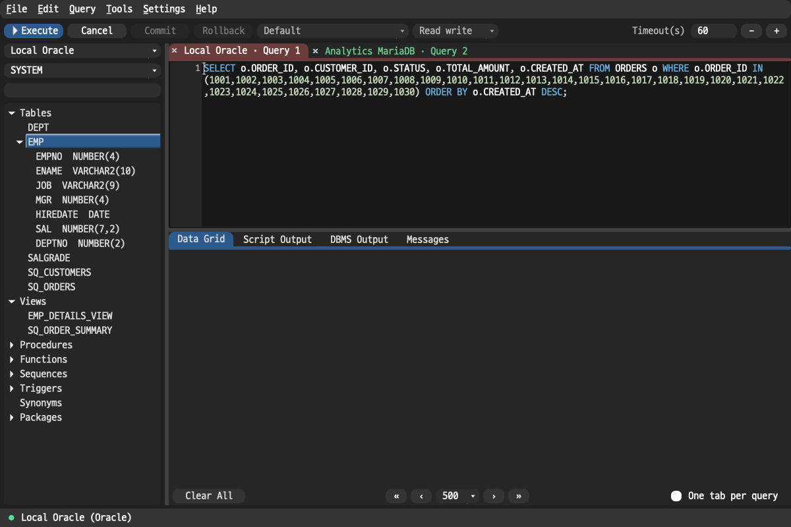

`Ctrl+G` asks for a line number and puts the caret there. A number past the end
of the buffer goes to the last line; a value that is not a plain number is
reported as an error.

#### Go to declaration and object search

`Ctrl+B` resolves the object name under the caret and opens its source in a new
editor tab: the body of a view, procedure, function, or package, and the
`CREATE` statement of a table. A package member opens its package, where its
source lives. Resolution uses the object browser's own lookup, so `Ctrl+B` opens
what the tree would open for the same name, including schema-qualified names and
package members.

`Ctrl+Shift+N` searches the objects of the current scope by name. Exact matches
come first, then prefixes, then anything containing the text. The arrow keys
move through the results while the caret stays in the search box, and `Enter`
opens the highlighted object's source. The list is built from metadata the
object browser has already loaded, so it needs no round trip and shows only what
the tree contains.

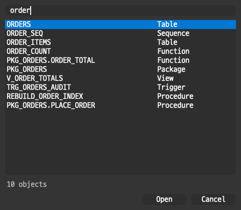

### SQL formatting

The formatter applies SQL-aware line breaks and indentation in place. It uses
the Oracle or MySQL/MariaDB dialect path of the active connection.

| Before | After `Ctrl+Shift+F` |
| --- | --- |
|  |  |

### Script execution

Script execution uses a dedicated parser and retained session state rather
than splitting text on every semicolon. Oracle bind variables, `PRINT`, and ref
cursors can produce results; MySQL/MariaDB `SHOW`, `DESC`, and `EXPLAIN`
statements are also handled as result sets. **Tools > Auto-Commit** controls
automatic transaction commits for the active connection.

<details>
<summary>Supported script and tool commands</summary>

Oracle / SQL*Plus family:

- `VAR`, `VARIABLE`, `PRINT`
- `SET SERVEROUTPUT`
- `SET DEFINE`, `SET SCAN`, `SET VERIFY`, `SET ECHO`, `SET TIMING`,
  `SET FEEDBACK`, `SET HEADING`
- `SET PAGESIZE`, `SET LINESIZE`, `SET TRIMSPOOL`, `SET TRIMOUT`,
  `SET SQLBLANKLINES`, `SET TAB`, `SET COLSEP`, `SET NULL`
- `SHOW ERRORS`, `SHOW USER`, `SHOW ALL`
- `DESC`, `DESCRIBE`
- `PROMPT`, `PAUSE`, `ACCEPT`
- `DEFINE`, `UNDEFINE`, `COLUMN ... NEW_VALUE`
- `BREAK ON <column>`, `BREAK OFF`
- `COMPUTE SUM`, `COMPUTE COUNT`, `COMPUTE OFF`, optionally with
  `OF <column> ON <group_column>`
- `CLEAR BREAKS`, `CLEAR COMPUTES`
- `SPOOL`
- `WHENEVER SQLERROR`, `WHENEVER OSERROR`
- `@`, `@@`, `START`
- `CONNECT`, `DISCONNECT`, `EXIT`, `QUIT`

MySQL / MariaDB family:

- `USE`
- `SHOW DATABASES`, `SHOW TABLES`, `SHOW COLUMNS`
- `SHOW CREATE TABLE`
- `SHOW PROCESSLIST`, `SHOW VARIABLES`, `SHOW STATUS`
- `SHOW WARNINGS`, `SHOW ERRORS`
- `DELIMITER`
- `SOURCE`

</details>

#### Bind parameter values

SQL copied out of application code keeps its placeholders. Running
`SELECT * FROM EMP WHERE EMPNO = :id`, or the JDBC spelling
`... WHERE EMPNO = ?`, opens a prompt for the values rather than sending a
statement the server cannot answer.

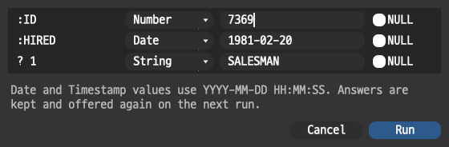

Every placeholder gets a row: its name, a type, the value, and a `NULL` box that
disables the value field. The type matters where a quoted string is a syntax
error rather than a different value: Oracle `FETCH FIRST :n ROWS ONLY` and MySQL
`LIMIT :n` need a number, not `'2'`. `Date` and `Timestamp` values are written
as `YYYY-MM-DD HH:MM:SS` on every backend. An empty box means SQL NULL for every
type but `String`.

PL/SQL OUT parameters are answered the same way: leave the value empty and pick
the type. Oracle adds a `Ref Cursor` type for an OUT `SYS_REFCURSOR`, which
disables the value and `NULL` controls on that row, so
`BEGIN emps_by_dept(:dept, :cnt, :rc); END;` runs and shows the cursor's rows
without a preceding `VARIABLE` line. The values the call assigns return to the
session and are reported the way `VARIABLE` binds are.

Procedures and functions are supported in each calling form:

| | Procedures | Functions |
| --- | --- | --- |
| Oracle | `BEGIN p(:a, :b); END;` · `EXEC` · `EXECUTE` · `CALL` · `DECLARE … BEGIN … END;` | `SELECT f(:a) FROM DUAL` · `BEGIN :r := f(:a); END;` · `EXEC :r := f(:a)` |
| MySQL / MariaDB | `CALL p(:a, @out)` | `SELECT f(:a)` |

`EXEC` is rewritten into a PL/SQL block in the execution worker, after the
prompt has read the text as written, so placeholders are recognized in the
spelling you typed. On MySQL an OUT argument must be a user variable; `@out` is
not a placeholder, so it passes through unchanged while the IN value beside it
is substituted.

What reaches the server differs by family. On Oracle the values become binds of
the declared type and the statement text is sent as written. MySQL and MariaDB
have no bind path here, so placeholders are replaced by quoted literals before
the statement is sent, and that substituted SQL is what the query history
records. Oracle `?` placeholders are rewritten to generated bind names
(`:SQ_P1`, …), because the server does not accept `?`.

Only placeholders with no value are prompted for. A bind declared with
`VARIABLE` is a standing declaration and is never prompted for, so
`VARIABLE id NUMBER` + `EXEC :id := 7369` works unchanged, and a statement
mixing a declared bind with an undeclared one asks only about the undeclared
one. A prompted value is not a declaration: it is offered again, prefilled, on
the next run. Cancelling the prompt runs nothing.

The value is sent as its declared type rather than as text pasted into the
statement, so it matches the column it is compared against: `NUMBER` /
`NUMBER(p,s)` / `BINARY_DOUBLE`, `VARCHAR2` / `CHAR` / `NVARCHAR2`, `DATE` /
`TIMESTAMP` / `TIMESTAMP WITH TIME ZONE`, `CLOB`, and `RAW` on Oracle; `INT` /
`BIGINT` / `DECIMAL` / `DOUBLE`, `VARCHAR` / `CHAR` / `TEXT`, `DATE` /
`DATETIME` / `TIMESTAMP` / `TIME`, `BLOB`, and `JSON` on MySQL and MariaDB.
Non-ASCII text is preserved on the round trip.

Colons that are not placeholders are left alone: a `'HH24:MI:SS'` format model,
a `q'[a:b]'` literal, a `:=` assignment, and the `:NEW` / `:OLD` correlation
names in a `CREATE TRIGGER` body.

### Explain plan

`F6` explains the statement at the cursor and shows the plan in its own Data
Grid tab.

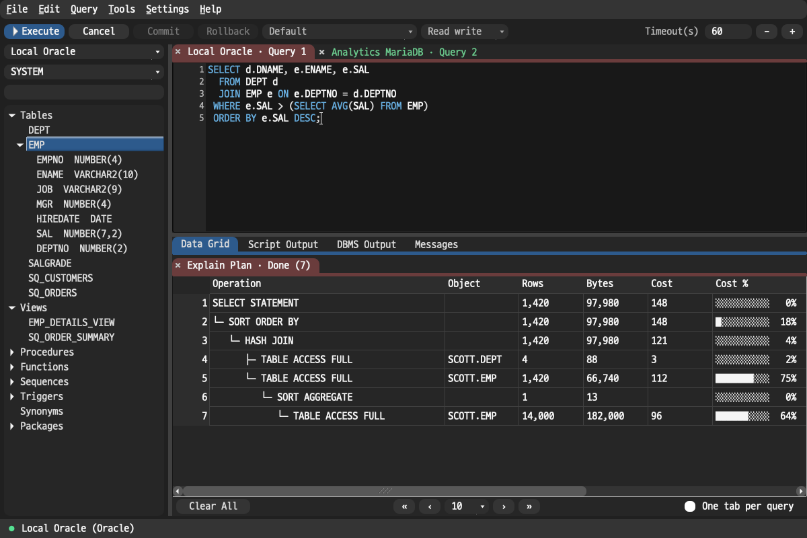

On Oracle the plan is read from `PLAN_TABLE` rather than from pre-rendered
`DBMS_XPLAN` text, so each step keeps the values the optimizer produced. The
connectors in the `Operation` column come from each step's reported parent, not
from indentation. `Cost` is the cumulative cost Oracle reports. `Cost %` is the
step's own cost — its cost minus its children's — as a share of the plan total,
which separates an expensive step from the ancestors that contain it. Access and
filter predicates appear on the rows they belong to rather than in a footnote.

MySQL and MariaDB keep the server's own `EXPLAIN` columns — `id`, `select_type`,
`table`, `type`, `key`, `rows`, `Extra`, and the rest — with a `Rows %` share
added. No tree is drawn: a classic `EXPLAIN` has no parent column, and deriving
one from `id` and `select_type` would be inference rather than a report.

The plan is an ordinary grid, so `Ctrl+F`, selection totals, copy, and export
all work on it.

### Object browser

The filterable object tree supports refresh, data queries, structure/index/
constraint inspection, DDL generation, and package routine browsing. Oracle
groups tables, views, procedures, functions, sequences, triggers, synonyms,
and packages. MySQL/MariaDB groups tables, views, procedures, functions,
triggers, and events, and shows sequences when the server exposes them.


#### Drop and truncate

The context menu ends with **Truncate...** on tables and **Drop...** on the
object types each backend can drop by name: tables, views, procedures,
functions, sequences, and triggers on both families; materialized views,
synonyms, and packages on Oracle; events on MySQL/MariaDB. Indexes are not
offered, because `DROP INDEX` needs the table the index belongs to, which a tree
node does not carry.

Neither runs on the click. A dialog first shows the exact statement that would
be sent and asks for confirmation. Only then is that statement put in the editor
and executed like any other, so the SQL that ran stays in front of you. The
statement is the one shown: no `CASCADE CONSTRAINTS`, no `PURGE`, and nothing
else added. A drop the database refuses reports its error and is not retried
with a broader statement.

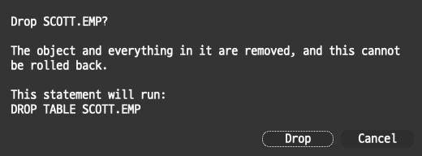

### Table browsing and bounded paging

Double-click a table in the object browser to open its rows in a dedicated
result tab. The filter bar above the grid keeps the **WHERE** and **ORDER BY**
editors at equal widths as the window resizes. Enter expressions without the
`WHERE` or `ORDER BY` keywords, press `Enter` to apply them, or use the clear
button to reset a field.

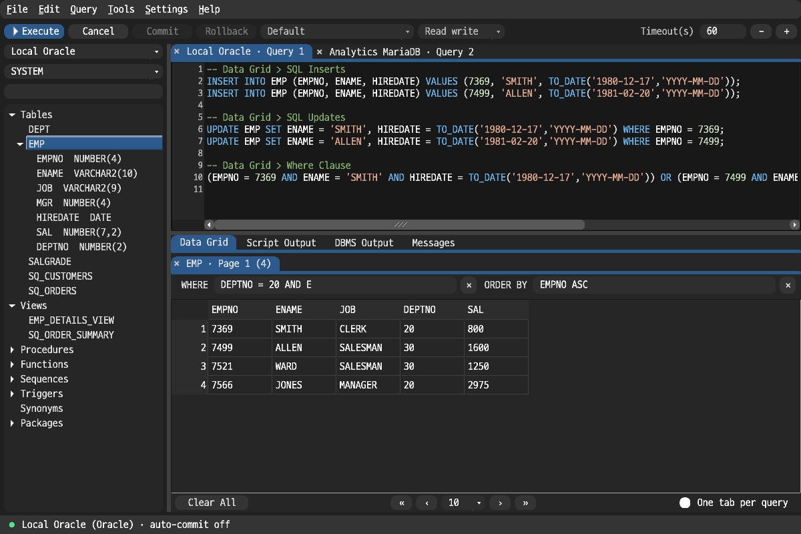

The same metadata-aware completion used by the SQL editor is available in
both fields. Start typing or press `Ctrl+Space` (`Cmd+Space` on macOS); the
suggestion popup opens directly below the text cursor in the active field. It
moves above the field or stays within the screen edge when space is limited.

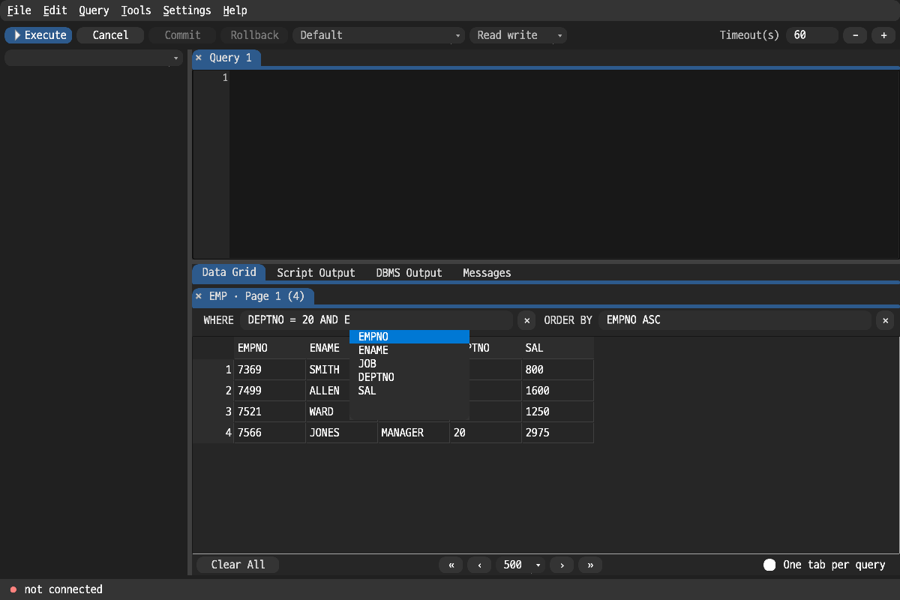

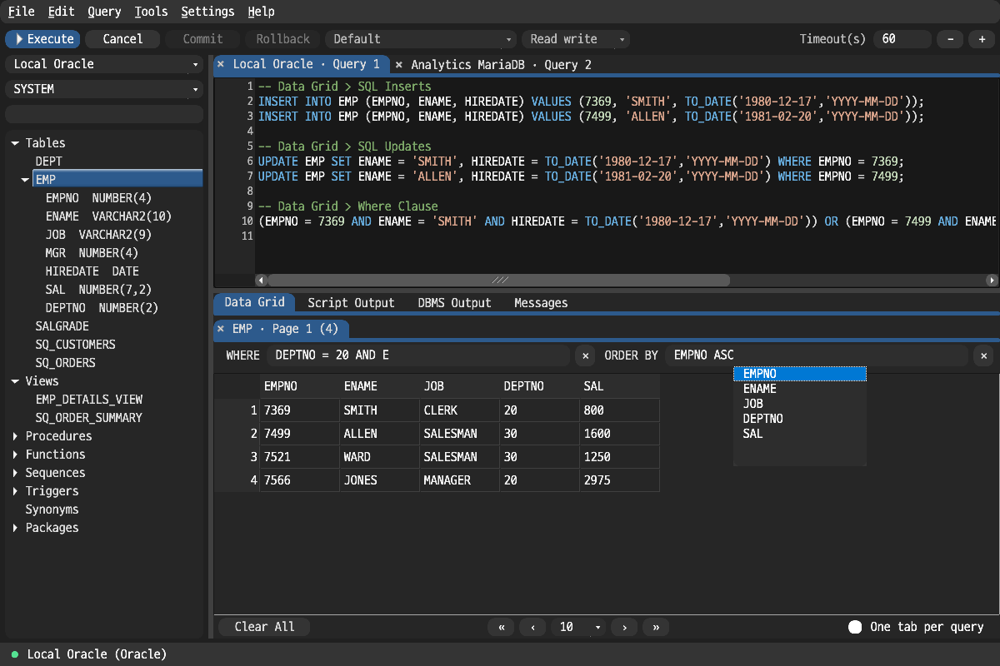

Use the first, previous, next, and last controls below the grid and choose a
page size of 10, 100, 250, 500, or 1,000 rows. Table browsing issues a bounded
query for each page—Oracle uses `ROWNUM`, while MySQL and MariaDB use
`LIMIT/OFFSET`—and does not retain a lazy-fetch cursor between pages. Completed
table tabs show `Page N` with the current page row count, and row headers retain
their absolute positions across pages.

### Result grid

- Drag or use the keyboard to select cells; `Ctrl+C` copies the selection and
  `Ctrl+Shift+C` includes headers.
- Resize columns, sort by a column header, or export the result with `Ctrl+E`.
- Configure the maximum cell preview length and lazy-fetch batch size. Scrolling
  near the end fetches more rows, while full-result actions can fetch all
  remaining rows first.
- Use the context menu to close a result, copy data as text or SQL, export data,
  or access available edit actions.


#### Find text in the rows on screen

With the result grid focused, `Ctrl+F` (`Cmd+F` on macOS) searches the rows that
have already been fetched. Nothing is sent to the server and no statement is
re-run, so this is available on a result the filter bar cannot re-query.

Every matching cell is highlighted and the current match is shown in a brighter
shade; a counter reports the position in the result. `Enter` and **Next** step
forward, `Shift+Enter` and **Previous** step back, and both wrap around. A
search starts from the selected cell rather than from the first row, and
matching is case-insensitive unless **Case sensitive** is ticked. The highlight
is cleared when the dialog closes.

Matching covers the full stored value, not the shortened text a narrow cell
draws, and it uses the same search as the editor's **Find**.

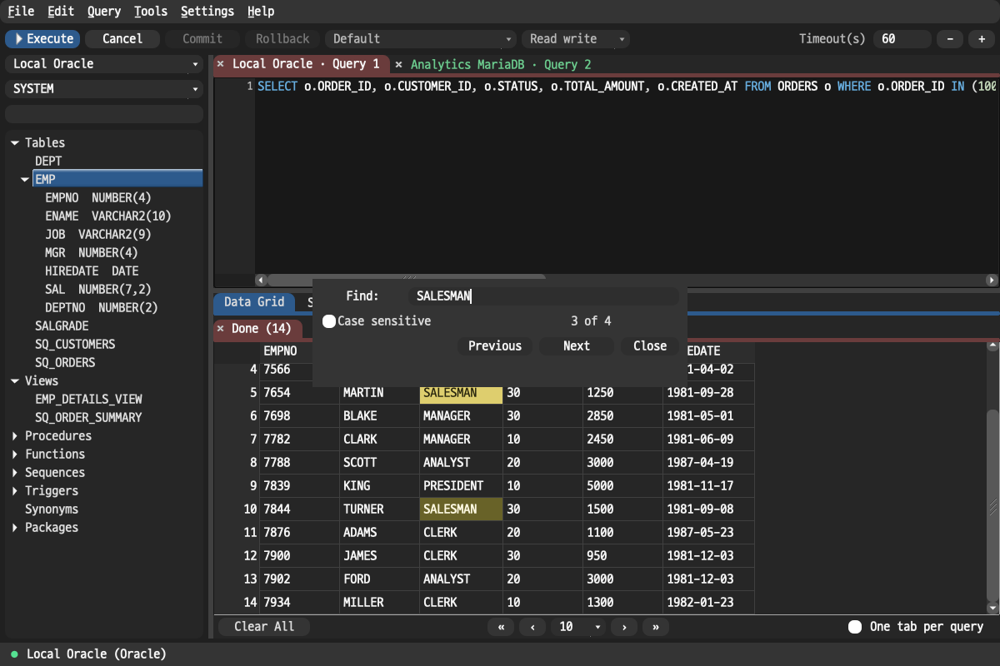

#### View and edit a cell value

A grid draws each cell as one clipped line, which is not enough for a CLOB, a
JSON document, or long text. Double-click a cell, or pick **View Value** from
the Data Grid context menu, to open it in a window showing the whole value, soft
wrapped, with its length in characters and bytes.

When the result is in **Edit** mode and the cell is one edit mode can write, the
same window opens as an editor and the menu entry reads **Edit Value**. Saving
stages the new value as the inline editor would, so it reaches the database on
the next **Save** and not before.

**Format** shows an indented copy of a JSON or XML value. It affects the view
only: clearing it returns the exact bytes being edited, and saving always writes
those bytes rather than the indented version. Formatting changes whitespace
only — JSON keeps its key order and its numbers as written, and an XML element
containing text is left alone, because in XML that whitespace is content. The
box is disabled for values that are neither JSON nor XML.

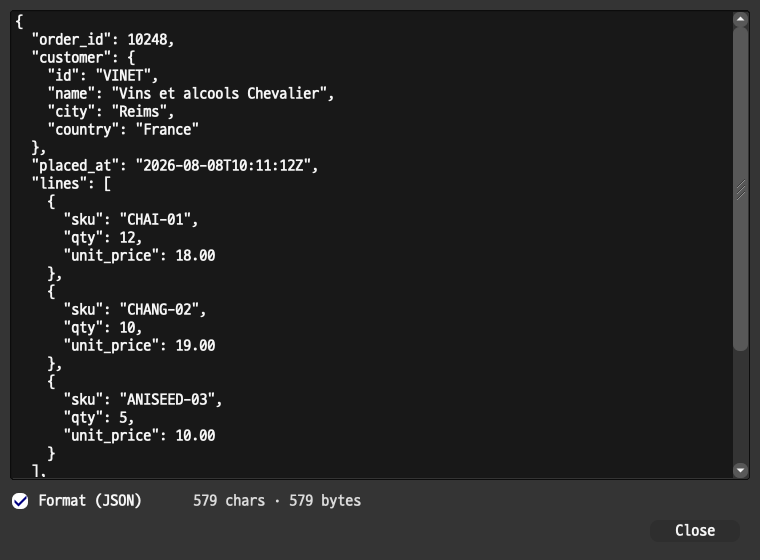

Long values save on every backend. MySQL and MariaDB use binds. Oracle
previously rendered values as SQL literals, so a value over 4000 bytes failed
with `ORA-01704` and a `CLOB` column could be read but not written. Oracle
values past that size are now written as concatenated `TO_CLOB` chunks, and the
original-value guard compares character LOBs with `DBMS_LOB.COMPARE`, which is
the comparison Oracle accepts (`clob_column = 'text'` raises `ORA-22848` at any
length).

#### Selection totals in the status bar

Selecting more than one cell shows a count, sum, average, minimum, and maximum
for that selection at the right end of the status bar. Nothing is sent to the
server; it is computed from the data the grid already holds. The line disappears
when the selection returns to a single cell.

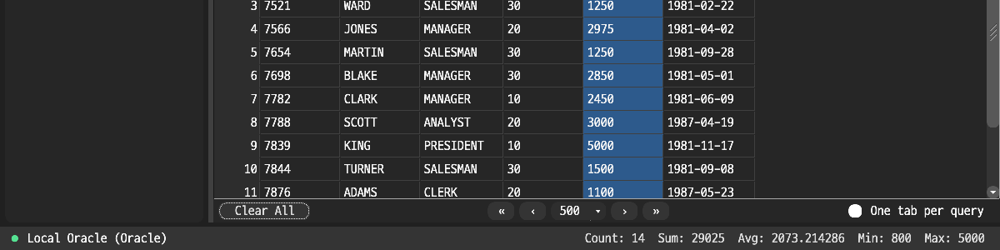

The aggregate follows SQL semantics: NULLs are skipped, and **Count** is the
number of non-NULL values rather than the number of cells. Sums use exact
decimal arithmetic on the value the driver produced, so `0.1 + 0.2` is `0.3` and
a long Oracle `NUMBER` keeps every digit. When any selected value is not a plain
number — text, a date, a number with thousands separators — only **Count** is
shown. A selection too large to scan reports its size instead.

For a safely identifiable Oracle, MySQL, or MariaDB single-table result,
**Edit** mode can stage inserted, updated, deleted, or `NULL` values. Oracle
uses `ROWID`; MySQL and MariaDB use a primary key or a non-null unique key.
Changes reach the database only after **Save**. MySQL/MariaDB locks each
existing target and checks its original values before mutation; Oracle uses
guarded `ROWID` DML with the same one-row rule. The whole save is rolled back
on a conflict. JOINs, multi-table results, and results without a reliable row
identifier remain read-only.


### Filter or sort a result the app cannot re-run

There are two ways to narrow a result, and each grid offers exactly one of them.

A result the app can re-run gets the **WHERE** / **ORDER BY** bar above the
grid, and what it produces is the server's answer. A result the app cannot
re-run gets neither bar: a script product, a statement holding bind or
substitution variables, a MySQL join repeating a column name, or a grid whose
connection has dropped. Those results get the local filter and sort described
below. Only one mechanism is live on a grid at a time, so the rows on screen
have a single explanation.

Right-click a cell and choose **Filter by Value** to keep the rows matching the
selected value, or **Exclude Value** to keep the rest. A strip above the grid
reports what is filtered and how many rows remain, with a `×` to remove it;
**Clear Value Filter** in the context menu does the same.

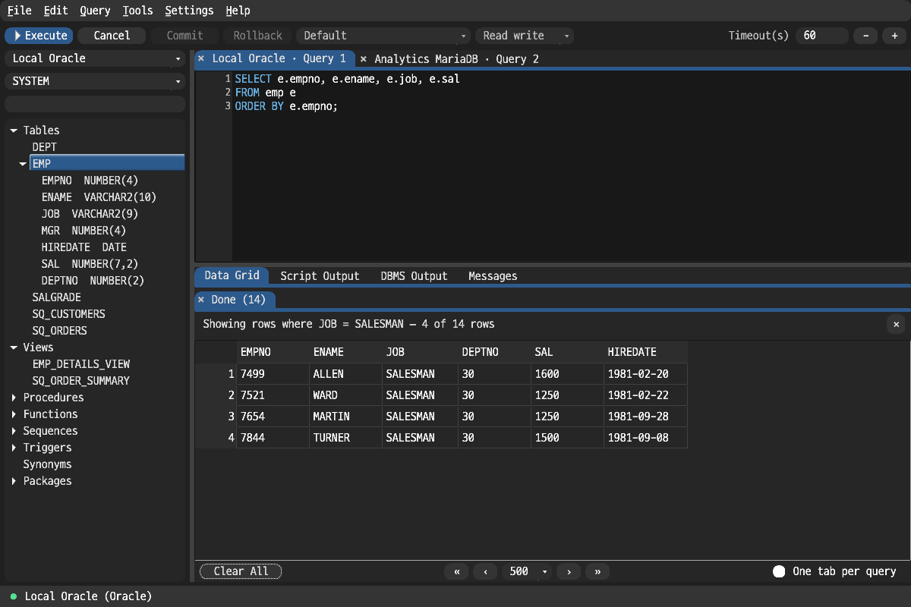

This filters rows already fetched and sends nothing to the server. Matching is
exact and case-sensitive on the text the grid is showing, and an empty cell
counts as `NULL` as it does elsewhere in the grid. The two directions partition
the result — every row is in one or the other — so excluding a value keeps the
`NULL` rows rather than dropping them the way `NOT IN` would.

Double-clicking a column header on such a result sorts it locally, and the
header shows the column and direction. Where a filter bar is present, the same
click fills its **ORDER BY** and re-queries, so the server does the ordering.

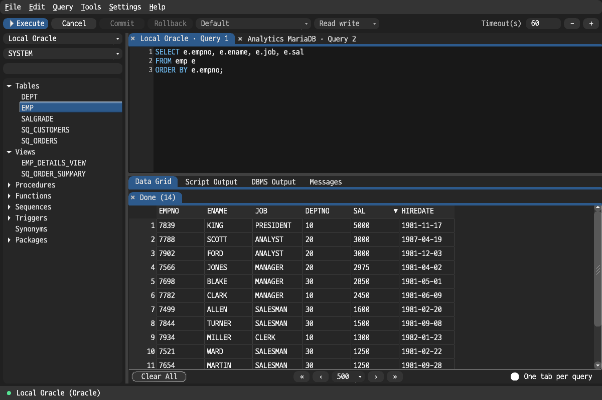

The local sort compares numbers by their digits rather than through `f64`, so a
38-digit Oracle `NUMBER` keeps every digit. It places `NULL` where the connected
database would: last for Oracle, first for MySQL and MariaDB. It does not
reproduce the server's collation — text compares by bytes, so `Z` sorts before
`a`. Where exact ordering matters, use a result the **ORDER BY** bar can
re-query.

Editing and filtering are kept apart in both directions: a value filter hides
rows, and staged edits are held against the rows on screen. Turn **Edit** off to
filter, and clear the filter to edit.

### Hide and reorder grid columns

Right-click the grid and choose **Columns...** to pick which columns are shown
and in what order.

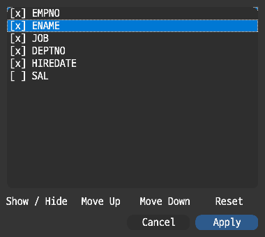

Double-click a column in the list, or use **Show / Hide**, to hide it; **Move
Up** and **Move Down** reorder; **Reset** restores the order the result arrived
in, undoing every change since, not only the ones made this time. At least one
column must stay visible, because an empty grid has no cell to open the context
menu from.

Hiding a column also removes it from what the grid copies and exports. The
arrangement belongs to the result and is dropped when a new one arrives. Columns
cannot be rearranged while **Edit** is on or while a result is still loading,
since both depend on the columns' positions.

Pinning a column to the left is not implemented.

### Reopen tabs after a crash

Editor tabs holding unsaved text are written to a snapshot every few seconds,
and the snapshot is deleted on a normal exit. It therefore survives only an
abnormal exit, and finding it at startup produces the offer to reopen.

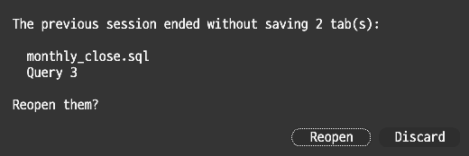

**Reopen** puts each tab back, still unsaved and still pointing at the file it
came from, so the next **Save** writes to the expected path. **Discard** removes
them. The snapshot is deleted either way, so a declined offer is not repeated. A
normal exit never shows this prompt.

Only tabs with unsaved changes are snapshotted, and only when their text has
changed since the last snapshot. A tab larger than 8 MB is skipped rather than
shortened, and the application log records which one, since a truncated script
would restore incorrectly.

### Export a result

`Ctrl+E`, **Tools > Export Results**, and the Data Grid context menu's
**Export Results** all open the same dialog: pick a format, choose whether to
export every row or the selection, and pick a file or the clipboard.

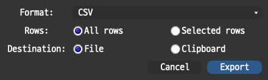

| Format | Notes |
| --- | --- |
| **CSV**, **TSV** | Files start with a UTF-8 BOM so Excel reads non-ASCII text correctly; the clipboard gets none |
| **JSON** | Array of objects; SQL `NULL` becomes `null`, and only genuinely numeric text stays unquoted |
| **XML** | `<results><row>…`; illegal characters in a column name become `_` |
| **HTML** | A standalone document with a plain bordered table |
| **Markdown** | Pipe table; `\|` is escaped and line breaks become `<br>` |
| **SQL Inserts** | The same statements the context menu copies, for the whole result and straight to a file |

**SQL Inserts** needs a live connection, because its literals follow the
connected dialect; the other formats do not. Exporting every row completes an
open lazy fetch first, so the file holds the whole result rather than the rows
scrolled into view. Exporting a selection never triggers a fetch.

### Export a table from the object browser

Right-click a table in the object browser and choose **Export Data...** to write
the whole table out without opening it first. It opens the same dialog as
**Export Results** and produces identical output; the row scope is fixed to
every row, since there is no selection to narrow.

The whole table is read, so a large one takes as long as reading it takes, and
the operation cannot be cancelled once started. A read-only connection keeps
this entry, since exporting only reads.

### Import a file into a table

Right-click a table in the object browser and choose **Import Data...**. Every
format the export writes can be read back, so a result exported from one
database can be loaded into another.

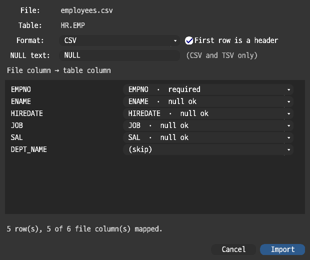

The dialog re-reads the file whenever a choice changes, so the column list, the
row count, and the mapping on screen describe what **Import** would run.

| Choice | What it does |
| --- | --- |
| **Format** | Preselected from the file's extension; change it to read the same file another way |
| **First row is a header** | CSV, TSV, and HTML only. On, the file names its columns; off, they are `COLUMN_1…n` |
| **NULL text** | CSV and TSV only. A cell holding exactly this text becomes SQL `NULL`. Defaults to `NULL`, which is what the export writes |
| **File column → table column** | One selector per file column, preset by matching names (or by position when there is no header). Send a column to `(skip)` to leave it out |

Each format is read back the way it was written, so an export/import round trip
returns the original values:

| Format | `NULL` is |
| --- | --- |
| **CSV**, **TSV** | A cell whose text equals the NULL text; a UTF-8 BOM is stripped |
| **JSON** | The `null` literal. Numbers keep their exact spelling, and a nested object or array is kept verbatim |
| **XML** | An empty element written `<C/>`; `<C></C>` is the empty string |
| **HTML**, **Markdown** | An empty cell |
| **SQL Inserts** | The `NULL` keyword. `TO_DATE`, `TO_TIMESTAMP`, `TO_TIMESTAMP_TZ`, and `HEXTORAW` are unwrapped back to the value they wrap, and any other expression is refused by name rather than quoted |

Literals are built from the **target column's declared type**, not from how a
value looks, as the SQL export does. A zero-padded code keeps its quotes and its
zeros, and a date-shaped string going into a `VARCHAR2` stays a string. Rows are
batched (100 per statement: a multi-row `VALUES` list on MySQL and MariaDB,
`INSERT ALL` on Oracle) and run as an ordinary script, so the import commits
when the session's auto-commit setting says it does and a failure is reported
like any other statement's.

Two limits are enforced rather than worked around: a file that is not UTF-8 is
refused rather than decoded incorrectly, and an `&` in a value is written as
`CHR(38)` on Oracle so it cannot be read as a substitution variable.

Formats that cannot express a value exactly are documented edges: Markdown trims
a cell and writes every line break as `<br>`, HTML and Markdown spell `NULL` and
the empty string the same way, and a CSV cell holding the NULL text is
indistinguishable from `NULL`.

### See a table's columns in the tree

Press `→` on a table in the object browser, or click its expand arrow, to list
its columns underneath with their types.

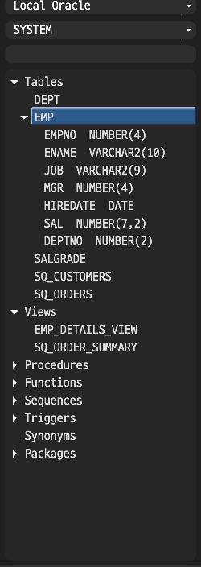

The columns are read once, on the first expand, using the same query
**View Structure** uses, so the two agree. Dragging a column into the editor, or
copying it, gives the bare column name, which is what a statement that already
names its table needs. Refreshing the object browser drops the cached columns so
an `ALTER TABLE` is picked up on the next expand.

Double-clicking a table still browses its rows; expanding is `→` and the arrow.

### Copy a selection as SQL

Select cells in the Data Grid, right-click, and take the selection as SQL on the
clipboard, ready to paste and run:

| Menu item | Clipboard contents |
| --- | --- |
| **SQL Inserts** | `INSERT INTO <table> (<selected columns>) VALUES (…);` per selected row |
| **SQL Updates** | `UPDATE <table> SET <selected non-key columns> WHERE <primary key>;` per row |
| **Where Clause** | `AND` within a row, `OR` between rows, and `IN` when one column is selected |

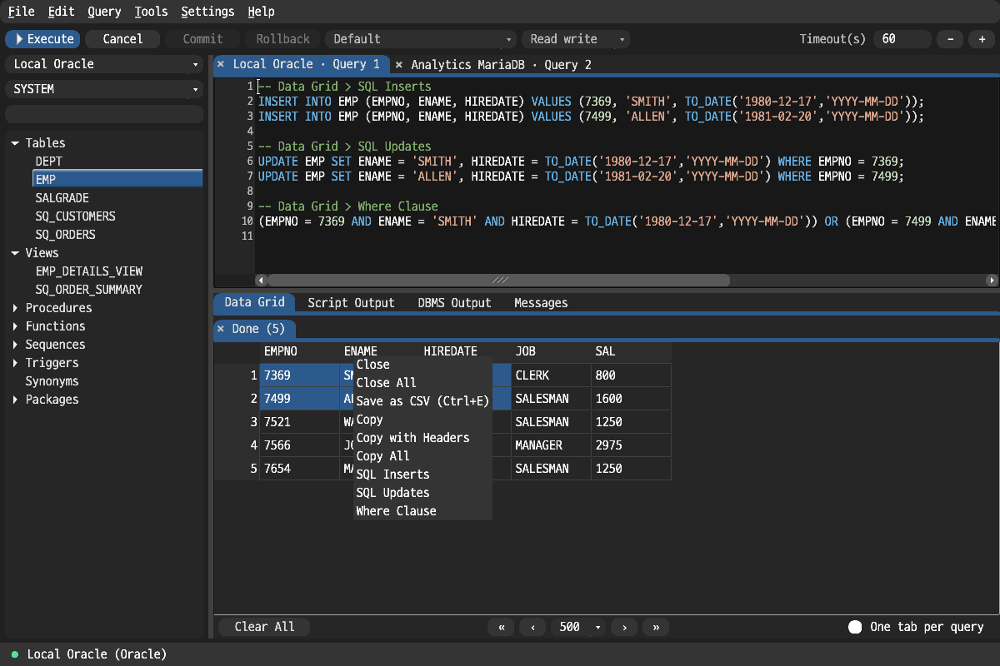

Values are rendered from the column types the driver reported, not from how a
value looks, so a `NUMBER` stays bare, a `DATE` becomes `TO_DATE(…)` on Oracle
or a quoted ISO string on MySQL/MariaDB, and a zero-padded `CHAR` code such as
`00123` keeps its quotes and its zeros. Oracle `RAW` becomes `HEXTORAW('…')`.

```sql
-- Data Grid > SQL Inserts, for two rows of EMPNO, ENAME, HIREDATE
INSERT INTO EMP (EMPNO, ENAME, HIREDATE) VALUES (7369, 'SMITH', TO_DATE('1980-12-17','YYYY-MM-DD'));
INSERT INTO EMP (EMPNO, ENAME, HIREDATE) VALUES (7499, 'ALLEN', TO_DATE('1981-02-20','YYYY-MM-DD'));

-- Data Grid > Where Clause, for the EMPNO column alone
EMPNO IN (7369, 7499)
```

Only the selection is exported; helper columns the grid uses internally do not
appear. **SQL Updates** identifies rows by the table's real primary key, read
from the database, and takes the key values from the whole row, so a key column
outside the selection still identifies its row. If the table has no usable key,
the `WHERE` clause is omitted and the status bar reports it. Results whose base
table cannot be determined, such as a join, fall back to `MY_TABLE`. A result
that is still fetching, or one a cancelled fetch left on screen, exports under
its real table name. See [docs/result_ui.md](docs/result_ui.md) for the per-type
rules and their known limits.

### Settings and diagnostics

**Settings > Preferences** controls editor/result fonts, global UI size, result
preview and lazy-fetch limits, connection-pool size, cancellation behavior, and
how many query-history and application-log entries are retained. Settings
persist between launches.


**Tools > Query History** searches executed statements, filters failures, shows
SQL and error details, and sends a selected statement back to the editor.
History is kept in a file and restored at the next launch; **Settings >
Preferences > History & Log** sets how many query-history and application-log
entries are retained.


**Tools > Session Activity** shows active and retained sessions, running SQL,
lazy fetches, result-tab ownership, fetched-row counts, and elapsed time.


**Tools > Application Log** filters, inspects, exports, and clears log entries.
If the app panics, it records `crash.log` and displays that report at the next
launch.


## Oracle connection modes

| Capability | Thin | OCI (thick) |
| --- | --- | --- |
| External Oracle client | Not required | Instant Client or Full Client required |
| Address | Host / Port / Service | Host / Port / Service or TNS alias |
| Transport | TCP | TCP or TCPS |

### OCI client discovery

The app searches for an OCI client in this order:

1. `ORACLE_CLIENT_LIB_DIR`
2. `ORACLE_HOME` (`%ORACLE_HOME%\bin` on Windows or `$ORACLE_HOME/lib` on
   macOS/Linux)
3. An `instantclient_*` directory under the platform defaults:
   - macOS: `/opt/oracle`
   - Linux: `/opt/oracle`, `/usr/local/oracle`
   - Windows: `C:\oracle`, `%ProgramFiles%\Oracle`

If discovery fails, set the library directory explicitly:

```bash
export ORACLE_CLIENT_LIB_DIR=/opt/oracle/instantclient_23_3
cargo run --release --bin space_query
```

On Apple Silicon, the app and OCI client must use the same CPU architecture.

### TNS aliases

TNS aliases are available only in OCI mode. Point `TNS_ADMIN` to the directory
containing `tnsnames.ora`:

```bash
export TNS_ADMIN=/opt/oracle/network/admin
```

Without `TNS_ADMIN`, Oracle Net checks `$ORACLE_HOME/network/admin`. Instant
Client has no equivalent default, so it normally requires `TNS_ADMIN` for alias
connections.

## Local data

SPACE Query uses the standard OS-specific roots returned by the Rust `dirs`
library:

| Data | Location |
| --- | --- |
| Settings, connection profiles, recent SQL files | `config_dir()/space_query/config.json` |
| Application log | `data_dir()/space_query/app.log.json` |
| Crash report | `data_dir()/space_query/crash.log` |
| Saved passwords | `space_query` service in the OS keyring |
| Query history | `data_dir()/space_query/query_history.json` |
| Unsaved editor tabs, kept only between an abnormal exit and the next start | `data_dir()/space_query/unsaved_tabs.json` |

Passwords are never written to `config.json`. Existing data in the legacy
`oracle_query_tool` config and keyring namespaces is migrated when encountered.

Only the application binary reads and writes these locations. Tests and the
`verify_*` harness binaries use a per-process scratch directory instead, so
running them cannot overwrite saved connections or preferences.

## Development

### Checks and tests

Run the non-live checks with the pinned toolchain:

```bash
cargo check --locked --bin space_query
cargo test --locked
cargo test --locked --manifest-path crates/tns-thin/Cargo.toml
```

The `tns-thin` crate is a path dependency rather than a workspace member, so it
has a separate test command. Live database tests require a configured local
database, credentials, and any applicable client libraries. Oracle Thin live
and comparison tests are available through:

```bash
./test_tns_thin.sh
```

Some behaviour can only be proven by running the application or a server. Those
checks are separate binaries:

```bash
# The import modal, driven through its own event loop.
cargo run --bin verify_import_ui

# Soft wrap, Go to Line and the object search modal, driven through the
# application's own menu bar.
cargo run --bin verify_editor_convenience_ui

# Export a table, import the file back, compare — every format, every backend.
cargo run --bin verify_import_live all

# Explain plan shape and Go to Declaration — every backend.
cargo run --bin verify_explain_plan_live all

# The bind-parameter modal, driven through its own event loop.
cargo run --bin verify_bind_prompt_ui

# Bind parameter values, declared and prompted — every backend.
cargo run --bin verify_bind_prompt_live all

# The cell value window, driven through its own event loop.
cargo run --bin verify_value_viewer_ui

# A long CLOB/TEXT value edited and read back — every backend.
cargo run --bin verify_value_edit_live all

# A read-only connection refuses writes and the database is unchanged, with a
# writable control group proving each statement is a real write — every backend.
cargo run --bin verify_read_only_live all

# The value filter, the local sort, the column arrangement and the export
# formats, each checked against the server's own answer — every backend.
cargo run --bin verify_grid_features_live all

# The column arrangement and the value filter driven on a real grid: where the
# rows and headers end up, and what a new result inherits from the last one.
cargo run --bin verify_column_layout_ui
```

Pull requests and pushes to `main` run formatting, Clippy, both non-live test
suites, and Linux x86_64, macOS arm64, and Windows x86_64 build checks in GitHub
Actions.

### Documentation

| Document | Purpose |
| --- | --- |
| [`docs/oracle.md`](docs/oracle.md) | Oracle development and live-test setup |
| [`docs/mysql.md`](docs/mysql.md) | MySQL development and live-test setup |
| [`docs/mariadb.md`](docs/mariadb.md) | MariaDB development and live-test setup |
| [`docs/session.md`](docs/session.md) | Session ownership, cancellation, and lazy-fetch rules |
| [`docs/transaction.md`](docs/transaction.md) | Transaction and retained-session behavior |
| [`docs/result_ui.md`](docs/result_ui.md) | Result tabs and grid behavior |
| [`docs/formatting.md`](docs/formatting.md) | SQL formatter structure and invariants |
| [`docs/highlighting.md`](docs/highlighting.md) | Syntax-highlighting pipeline |
| [`docs/new_backend.md`](docs/new_backend.md) | Checklist for adding a database backend |

### Regenerate feature screenshots

On macOS, regenerate all images under `docs/images` with:

```bash
./scripts/capture_feature_tour.sh
```

Pass an image name to capture only that scene, for example:

```bash
./scripts/capture_feature_tour.sh object-browser
```

The capture implementation is in `src/bin/capture_feature_tour.rs` and uses
isolated application settings.

## Release verification

Each GitHub Release contains `SHA256SUMS` for the macOS and Windows archives.
Verify it on Linux:

```bash
sha256sum --check SHA256SUMS
```

Or on macOS:

```bash
shasum -a 256 --check SHA256SUMS
```

Release archives also have GitHub artifact provenance attestations. With an
authenticated GitHub CLI, verify an archive with:

```bash
gh attestation verify space_query-macos-arm64.zip \
  --repo letspurify-ux/space_query
```

Checksums verify archive integrity, and attestations verify the GitHub Actions
build origin. Neither replaces Apple Developer ID or Windows Authenticode code
signing.

Release archives include the executable, `DISCLAIMER.md`, and a `licenses/`
directory containing the SPACE Query licenses, third-party notices and
dependency licenses, `tns-thin` provenance, referenced upstream notices, and
the copyright text for the Rust toolchain used to build the binary.

## License

Original SPACE Query code is available under `MIT OR Apache-2.0`; see
[`LICENSE-MIT`](LICENSE-MIT) and [`LICENSE-APACHE`](LICENSE-APACHE). The
software is provided without warranty and remains subject to
[`DISCLAIMER.md`](DISCLAIMER.md).

The bundled `tns-thin` crate is licensed under Apache-2.0. Parts of the Oracle
Thin implementation are modified works based on Apache-2.0 material from
`python-oracledb`, and parts were developed with reference to `go-ora`, whose
MIT license file covers only that material. It contains no Oracle client
software.

Release binaries statically link FLTK, which is distributed under the GNU
Library General Public License, Version 2, with the FLTK exceptions, including
its static linking exception. SPACE Query is based in part on the work of the
FLTK project (<https://www.fltk.org>) and, through FLTK's image libraries, on
the work of the Independent JPEG Group. Other statically linked components
include ODPI-C (Universal Permissive License, Version 1.0 option), `cfltk`
(MIT), and Zstandard (BSD option).

Third-party attribution, exact upstream revisions, and full dependency license
texts are recorded in [`THIRD_PARTY_NOTICES.md`](THIRD_PARTY_NOTICES.md),
[`THIRD_PARTY_DEPENDENCIES.md`](THIRD_PARTY_DEPENDENCIES.md),
[`crates/tns-thin/THIRD_PARTY_NOTICES.md`](crates/tns-thin/THIRD_PARTY_NOTICES.md),
and [`crates/tns-thin/PROVENANCE.md`](crates/tns-thin/PROVENANCE.md).

### Trademarks

Oracle, Java, MySQL, SQL\*Plus, and NetSuite are trademarks or registered
trademarks of Oracle and/or its affiliates. MariaDB is a trademark of MariaDB
Corporation Ab. Other names may be trademarks of their respective owners. These
names are used only to identify the software SPACE Query connects to or builds
on. This project is independent and is not affiliated with, endorsed by, or
sponsored by Oracle, MariaDB Corporation Ab, or any other vendor.
